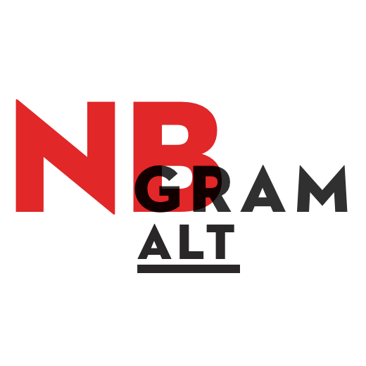

NB Ngram Alt is an alternative viewer for [NB Ngram][1], which is developed by [Språkbanken][2].

I wrote it partly as a coding exercise, but also to generate alternative graphs. Highchars.js provides more export options and possibilities for dymamic rendering. I also plan to add options for [XKCD-style graphs](http://xkcdgraphs.com), [plot.ly](https://plot.ly/) exports and a [sparkline](http://en.wikipedia.org/wiki/Sparkline) generator.

A demo is avaiable at [jekyll-hyde.no/nbngram](http://jekyll-hyde.no/nbngram)

It uses the (undocumented) API and outputs the results in [Highcharts][3].

[1]: http://www.nb.no/sp_tjenester/beta/ngram_1
[2]: http://www.nb.no/Tilbud/Forske/Spraakbanken
[3]: http://highcharts.com
